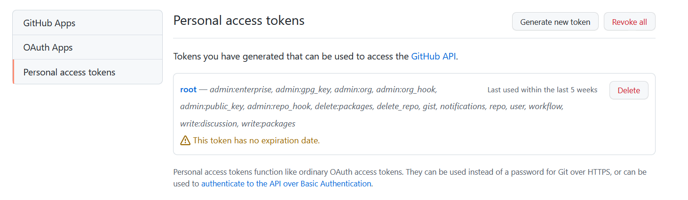

# github-settings
github 설정


## Github Lable 세팅

### github-label-sync 설치

```sh
npm install -g github-label-sync
```

### Github 엑세스 토큰 발급

[https://github.com/settings/tokens](https://github.com/settings/tokens)

- 신규 토큰 생성 버튼 클릭 (Generate new token )
- 토큰 이름 입력
- scope는 repo로 입력
- 생성된 토큰 clipboard로 복사





### label.json 설정
label의 name, color, description, aliases 를 정의할 수 있고, JSON, YAML 둘 다 가능

JSON: 

```json
[    
    {
        "name": "mylabel",
        "color": "ff0000",
        "aliases": [],
        "description": "optional description"
    }
]
```

YAML: 

```yaml
- name: mylabel
  color: "ff0000"
  aliases: []
  description: optional description
```

### 레포지토리에 적용

```sh
github-label-sync --access-token [액세스 토큰] --labels labels.json [계정명]/[저장소 이름]
``` 

## 참고
- [Creating a personal access token](https://docs.github.com/en/authentication/keeping-your-account-and-data-secure/creating-a-personal-access-token)
- [managing label](https://docs.github.com/en/issues/using-labels-and-milestones-to-track-work/managing-labels)
- [github-label-sync](https://github.com/Financial-Times/github-label-sync)